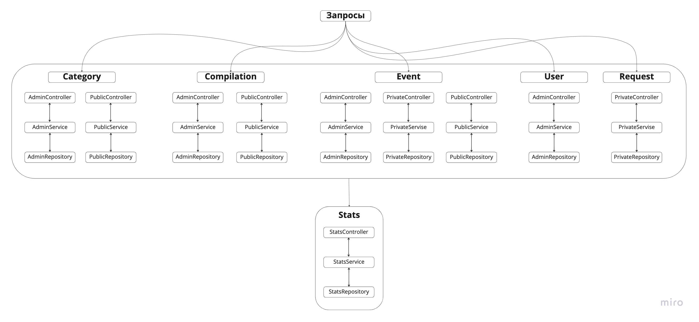

Template repository for ExploreWithMe project.
https://github.com/ElenaLut/java-explore-with-me/pull/1

Explore with me

Вы любите веселиться, знакомиться с новыми людьми, не сидеть на месте?
Возможно вы устали искать интересные предложения на просторах интерната? 
Искать себе пару для посещений?
И расстраиваетесь, когда пропускаете что-то интересное?

Тогда этот сервис для вас!

Explore with me - это сервис, в который поможет быть в курсе всех событий!

Пользователи добавляют мероприятия и отправляют заявки на участие. На главной странице для вас уже подготовлены подборки событий от наших администраторов.

Возможности сервиса:
- создание мероприятий. Мероприятия могут быть открытыми и закрытыми (заявки рассматриваются автором);
- поиск мероприятий по любым характеристикам;
- отправка запросов на участие;
- просмотр подборок и категорий.

Для авторизованных и неавторизованных пользователей доступные разные возможности.

Администраторы системы могут:
- проверять и публиковать мероприятия;
- создавать подборки и категории событий;
- закреплять подборки на главной странице.

Архитектура системы

В проекте 2 модуля:
- server - принимает запросы на объекты системы и обрабатывает
- stats - собирает и сохраняет статистику

Server:
- user - запросы администратора: получение всех пользователей, создание и удаление пользователи
- category - запросы администратора: создание, изменение и удаление категории. Публичные запросы на получение всех категорий или конкретной.
- compilation - публичные запросы на получение всех подборок или конкретной. Администратор может: создавать и удалять подборки, добавлять и удалять события из них и крепить подборки на главной.
- event - администратор может: искать события по критериям, редактировать, публиковать или отклонять. Авторизованные пользователи могут: получать свои события, добавлять менять, удалять, обрабатывать запросы. Публичные запросы: получение всех событий или конкретной.
- request - доступны только авторизованным пользователям: получение своих запросов, создание и отмена.
